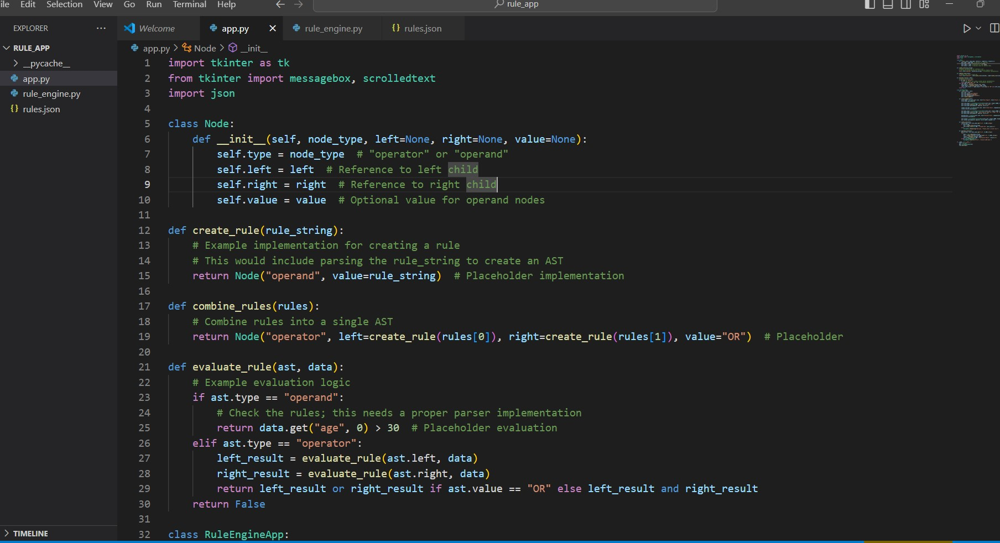
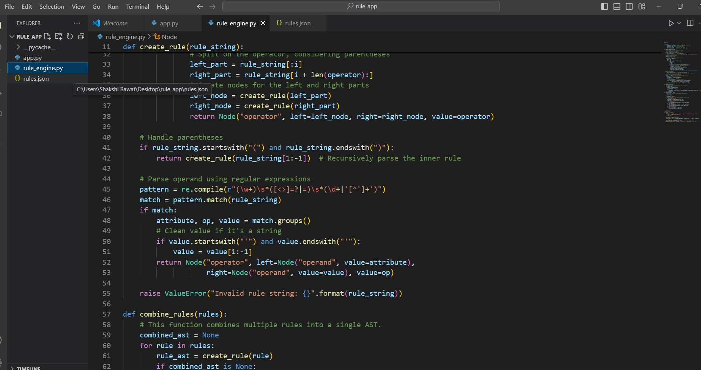
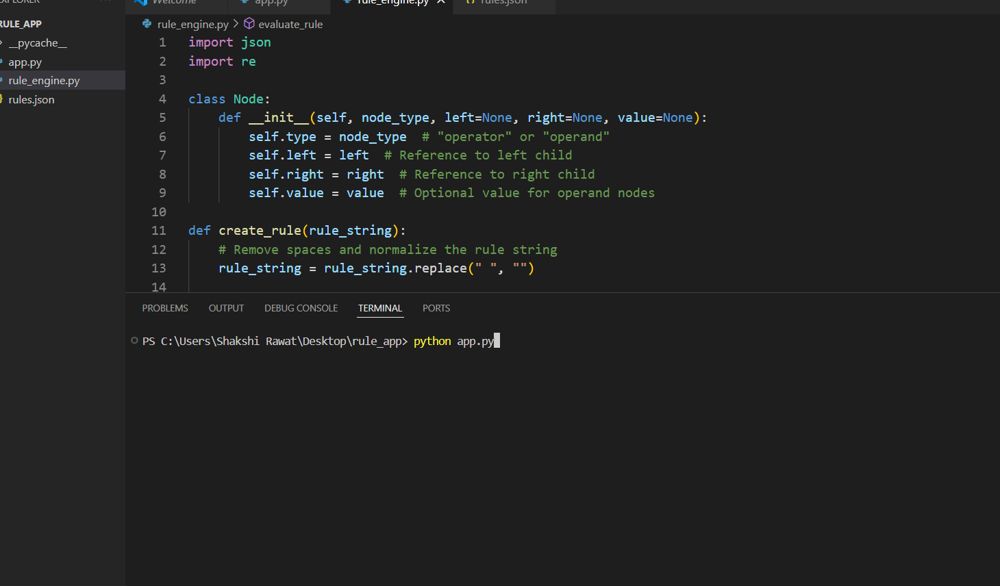
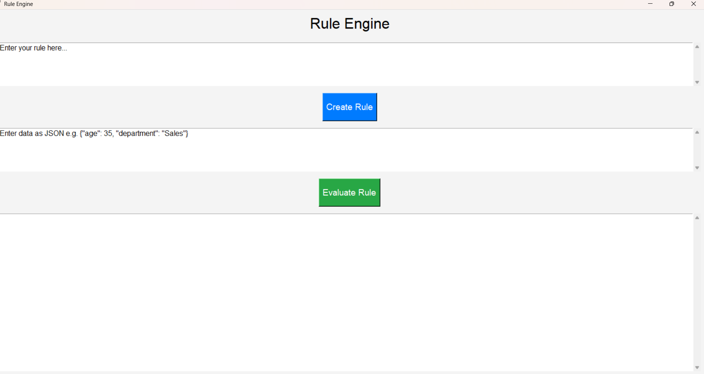

Rule Engine with AST for User Eligibility

PROJECT OVERVIEW-

This is a 3-tier rule engine application developed using Python and Tkinter for the UI, which evaluates user eligibility based on dynamic rules defined with an Abstract Syntax Tree (AST). The application enables rule creation, modification, and evaluation using criteria such as age, department, income, and experience.

FEATURES-
Dynamic Rule Creation: Easily create rules using a simple syntax (e.g., (age > 30 AND department = 'Sales') OR (salary > 50000)).
Rule Combination: Combine multiple rules to create complex eligibility conditions.
AST Representation: Rules are represented as ASTs for efficient parsing and evaluation.
User Evaluation: Input user data (e.g., age, department) to evaluate eligibility based on defined rules.
Interactive UI: Built with Tkinter, the application provides an intuitive and user-friendly interface.

Technologies Used-
Programming Language: Python
Libraries: Tkinter (for UI), JSON (for data handling).

Setup Instructions-
Prerequisites
Python 3.x
Tkinter (usually bundled with Python)
Git (for version control)

Installation-

Clone the Repository- git clone https://github.com/sakshirwt15/AST_project.git
cd AST_project
Run the Application- python app.py

Screenshots of project-

## Main Interface

*Main interface with options for rule creation, combination, and evaluation.*

### Rule Creation Screen

*Input fields to create rules using predefined conditions.*

### Run command

### Output Result

*basic interface of project*

.png)

*rule creation successfull*

.png)

*Displays the eligibility evaluation results based on entered data.*

Future Enhancements

Improved Error Handling: More descriptive errors for invalid rule strings or missing data.
Advanced Rule Functions: Allowing user-defined functions within rules.
Database Integration: Adding support for saving and loading rules to a database for persistence.
Contributing
Contributions are welcome! Please fork the repository and submit a pull request with a detailed description of your changes.

License
This project is open-source and free to use under the MIT License.
